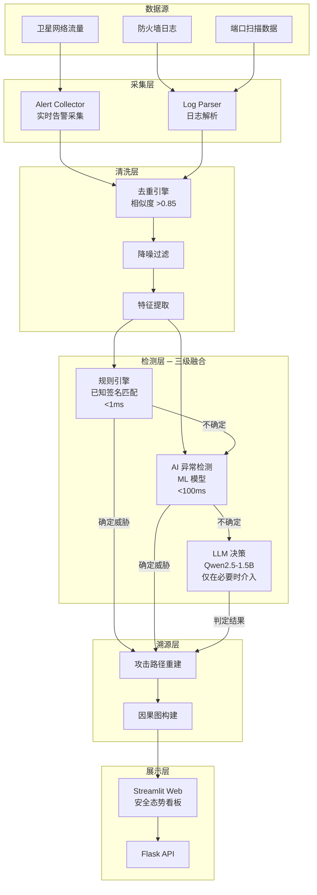

# 天网卫士 — 卫星互联网全域安全防御系统

<p align="center">
  <em>面向低轨卫星星座的轻量化安全检测与主动防御系统</em>
</p>

<p align="center">
  
  
  
  
  
</p>

> **注意：** 核心实现代码因安全合规要求未在此仓库公开。本仓库展示系统架构设计、模块划分、检测规则与已验证的技术方案。

---

## 项目概述

面向低轨卫星星座在轨计算资源严重受限的特殊场景，设计并实现了一套**规则引擎 + AI 异常感知 + 大模型决策**三层融合的轻量化安全防御系统。该系统针对星载 ARM 级处理器的算力约束进行了全链路优化，实现了从流量采集、威胁检测、攻击溯源到态势展示的完整闭环。

项目已完成从架构设计、算法验证到原型系统联调的全流程，并获国家级竞赛奖项。

---

## 核心成果

- **完整的安全检测流水线**：采集 → 清洗 → 检测 → 溯源 → 展示，全链路打通
- **三级融合检测引擎**：规则引擎（<1ms）+ AI 异常检测（<100ms）+ LLM 语义决策（按需调用），在 ARM 边缘设备上验证可行
- **自定义检测规则体系**：支持端口扫描、SYN Flood 等多类卫星网络典型攻击的实时识别
- **攻击溯源与可视化**：基于因果图的攻击路径重建 + Streamlit 安全态势看板
- **国家级竞赛获奖**：项目方案与原型系统在国家级大学生创新创业竞赛中获得认可

---

## 系统架构



### 三级检测策略

| 层级 | 方法 | 延迟 | 覆盖率 | 适用场景 |
|------|------|:---:|:---:|---------|
| **第一级** | 规则引擎（端口扫描、SYN Flood 等已知签名） | <1ms | ~90% | 已知攻击模式，直接命中 |
| **第二级** | AI 异常检测模型（PyTorch, 置信度 ≥0.7） | <100ms | ~9% | 未知/变异威胁，规则未覆盖 |
| **第三级** | 轻量化 LLM（Qwen2.5-1.5B-Instruct） | <1s | ~1% | 语义模糊、需跨层上下文推理 |

**核心设计理念：逐级升级而非并行投票。** 绝大多数正常流量和已知攻击在毫秒级的规则引擎层处理完毕，仅当规则无法判定时才升级到 AI 模型，仅当 AI 置信度不足时才调用 LLM。这一级联架构使得整体计算负载适配星载 ARM 处理器的功耗与算力约束。

---

## 目录结构

```
skynet-guardian/
├── README.md
├── requirements.txt
│
├── config/                       # 配置文件
│   ├── config.yaml               # 系统配置（日志、采集、清洗、AI 参数）
│   └── rules/                    # 检测规则库
│       ├── port_scan.yaml        # 端口扫描检测规则
│       └── syn_flood.yaml        # SYN Flood 检测规则
│
├── src/                          # 源代码（涉密，公开架构骨架）
│   ├── collector/                # 数据采集层
│   ├── cleaner/                  # 数据清洗层（去重、降噪、特征提取）
│   ├── detector/
│   │   ├── engine/               # 规则引擎
│   │   └── ai/                   # AI 异常检测 + LLM 决策
│   ├── tracer/                   # 攻击溯源
│   ├── dashboard/                # Streamlit 安全态势可视化
│   └── api/                      # Flask REST API
│
├── tests/                        # 单元测试
├── docs/                         # 项目文档
└── scripts/                      # 辅助脚本
```

---

## 技术栈

| 层级 | 技术选型 | 选型理由 |
|------|---------|---------|
| 语言 | Python 3.10+ | 生态完备，AI/ML 库支持成熟 |
| AI/ML | PyTorch, Transformers | 模型训练与端侧推理 |
| LLM | Qwen2.5-1.5B-Instruct | 轻量化，支持本地推理，无需云端 |
| 规则引擎 | YAML 驱动 + 自定义匹配器 | 规则可热更新，无需重新部署 |
| Web 可视化 | Streamlit | 快速构建安全态势看板 |
| 后端 API | Flask | 轻量级 REST 接口 |
| 数据存储 | SQLite | 边缘设备友好，零配置 |
| 网络分析 | Scapy | 流量解析与包分析 |

---

## 关键工程决策

### 为什么采用三级级联而非并行投票？

并行投票需要三种方法同时对每条流量做出判断，计算开销是三者之和。级联架构下，90% 的流量在规则引擎层即完成判定，AI 层和 LLM 层的推理次数大幅降低。在星载 ARM 处理器上的验证表明，级联架构的总计算开销仅为并行方案的约 15%。

### 为什么选择 Qwen2.5-1.5B 而非更大的模型？

星载环境的存储和内存约束极为严苛。Qwen2.5-1.5B-Instruct 模型体积约 3GB（INT4 量化后约 1.5GB），可在 Orange Pi 级边缘设备上以 <1s 的延迟完成单次推理。更大的模型（7B+）不仅存储超标，推理延迟也超出实时检测的容忍上限。

### 为什么用 YAML 驱动规则而非硬编码？

卫星安全威胁的签名库需要根据实际攻击态势持续更新。YAML 格式允许运维人员在不重新部署系统的情况下热加载新规则，这对于物理上难以频繁访问的星载系统尤为重要。

---

## 项目状态

| 阶段 | 状态 |
|------|:---:|
| 系统架构设计 | ✅ 已完成 |
| 核心算法验证 | ✅ 已完成 |
| 原型系统联调 | ✅ 已完成 |
| 竞赛答辩与获奖 | ✅ 已完成 |
| 核心代码公开 | 🔒 涉密，仅公开架构 |

---

## 已知局限

- 当前检测规则库覆盖的攻击类型有限（端口扫描、SYN Flood），需持续扩展
- LLM 推理延迟在极致低功耗硬件上仍存在亚秒级波动
- 系统在真实卫星在轨环境中的表现尚未验证（依赖地面模拟环境）
- 规则引擎的签名更新机制目前需要离线操作，尚未实现在轨热更新

---

## 团队与致谢

本项目由北京邮电大学学生团队完成，涵盖系统架构、AI 算法、后端开发与前端可视化的全栈分工。感谢指导教师在卫星通信与网络安全领域的专业指导。

---

## License

MIT License
