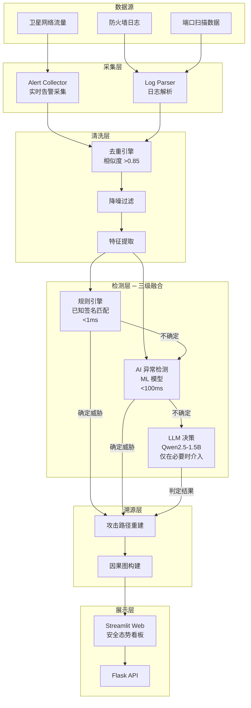

# 天网卫士 — 卫星互联网全域安全防御系统

<p align="center">
  <em>面向低轨卫星星座的轻量化安全检测框架</em>
</p>

<p align="center">
  
  
  
  
</p>

> **注意：** 本项目处于立项提案阶段，源码为架构骨架。具体实现代码因涉密要求不在此仓库公开。本仓库仅展示系统架构设计、模块划分和概念验证方案。

---

## 项目概述

面向国家"空天一体化"战略需求，针对低轨卫星星座在轨计算资源严重受限的特殊场景，提出一套**规则引擎 + AI 异常感知 + 大模型决策**三层融合的轻量化安全防御架构。

**核心挑战：** 卫星在轨环境具有极端的算力、功耗和带宽约束，传统地面网络安全方案（深度学习模型 >100MB、实时云端查询）无法直接部署。如何在 ARM 级低功耗硬件上实现可用的威胁检测？

**技术路线：** 分级检测策略——规则引擎快速匹配已知威胁（毫秒级），AI 模型处理可疑但不确定的流量（毫秒级），轻量化 LLM 仅在前两级无法判定时介入语义决策，将整体计算负载控制在卫星可承受范围内。

---

## 系统架构



### 三级检测策略

| 层级 | 方法 | 延迟 | 适用场景 |
|------|------|:---:|---------|
| **第一级** | 规则引擎（端口扫描、SYN Flood 等已知签名） | <1ms | 已知攻击模式 |
| **第二级** | AI 异常检测模型（PyTorch, 置信度 ≥0.7） | <100ms | 未知/变异威胁 |
| **第三级** | 轻量化 LLM（Qwen2.5-1.5B-Instruct） | <1s | 语义模糊、需上下文推理 |

**设计理念：** 不是三种方法并行跑然后投票，而是逐级升级——90% 的流量在规则引擎层处理，9% 在 AI 层，仅 1% 升级到 LLM 层。这在保证检测能力的同时最小化计算开销。

---

## 目录结构

```
skynet-guardian/
├── README.md
├── requirements.txt
│
├── config/                       # 配置文件
│   ├── config.yaml               # 系统配置（日志、采集、清洗、AI）
│   └── rules/                    # 检测规则
│       ├── port_scan.yaml        # 端口扫描规则
│       └── syn_flood.yaml        # SYN Flood 规则
│
├── src/                          # 源代码（骨架）
│   ├── collector/                # 告警采集
│   ├── cleaner/                  # 数据清洗（去重、降噪、特征提取）
│   ├── detector/
│   │   ├── engine/               # 规则引擎
│   │   └── ai/                   # AI 异常检测 + LLM 决策
│   ├── tracer/                   # 攻击溯源
│   ├── dashboard/                # Streamlit 可视化
│   └── api/                      # Flask REST API
│
├── tests/                        # 单元测试
├── docs/                         # 项目文档
└── scripts/                      # 文档处理脚本
```

---

## 技术栈

| 层级 | 技术 |
|------|------|
| 语言 | Python 3.10+ |
| AI/ML | PyTorch, Transformers |
| LLM | Qwen2.5-1.5B-Instruct（轻量化本地推理） |
| 规则引擎 | YAML 驱动, 自定义匹配器 |
| Web 可视化 | Streamlit |
| 后端 API | Flask |
| 数据存储 | SQLite |
| 网络分析 | Scapy |

---

## 核心创新点

1. **星上轻量化适配**：分级检测策略将整体计算负载控制在 ARM 级星载处理器可承受范围内，避免"上星即降级"的困境
2. **规则 + AI + LLM 三层融合**：不是简单的投票集成，而是逐级升级的级联架构，兼顾检测范围与计算效率
3. **跨层协同**：将物理层遥测数据与网络层安全告警关联分析，提供更立体的威胁判定依据
4. **分钟级主动巡检**：对卫星暴露面进行周期性扫描，发现异常开放端口与服务

---

## 项目状态

| 阶段 | 状态 |
|------|:---:|
| 系统架构设计 | ✅ |
| 项目立项申请 | ✅ |
| 概念验证方案 | ✅ |
| 核心代码实现 | 🚧 开发中（涉密，未公开） |
| 星上环境测试 | 📋 计划中 |

---

## 已知局限

- 卫星在轨环境的实际算力约束需在真实硬件上验证
- LLM 本地推理在卫星上的可行性需要进一步量化评估
- 当前仅为架构设计阶段，缺乏真实卫星流量数据进行训练和测试
- 规则引擎的签名库需要持续更新和维护

---

## 团队与致谢

本项目由北京邮电大学电子工程学院学生团队提出，闫晓丹副教授指导。

---

## License

MIT License
